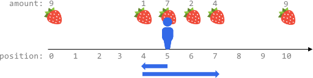

# 2106. 摘水果

## 题目描述

在一个无限的 x 坐标轴上，有许多水果分布在其中某些位置。给你一个二维整数数组 fruits ，其中 fruits[i] = [positioni, amounti] 表示共有 amounti 个水果放置在 positioni 上。fruits 已经按 positioni 升序排列 ，每个 positioni 互不相同 。

另给你两个整数 startPos 和 k 。最初，你位于 startPos 。从任何位置，你可以选择 向左或者向右 走。在 x 轴上每移动 一个单位 ，就记作 一步 。你总共可以走 最多 k 步。你每达到一个位置，都会摘掉全部的水果，水果也将从该位置消失（不会再生）。

返回你可以摘到水果的 最大总数。

示例：


## 分析

### 1. 暴力解法：枚举

确定枚举项，从当前位置向左x步，再向右k-x步；或者向右x步，再向左k-x步。x的范围是从0到k/2。

计算移动范围内的收获量：

移动区间为`[startPos - x, startPos + (k - 2x)]`或`[startPos - (k - 2x), startPos + x]`，利用二分法，快速定位fruits中的起点和终点。

**二分查找说明：**

- 使用自定义比较函数，只比较 `fruits[i][0]`（位置）
- `lower_bound` 找到第一个位置 ≥ left 的水果
- `upper_bound` 找到第一个位置 > right 的水果
- 这样可以正确定位区间 `[left, right]` 内的所有水果

### 优化：前缀和

使用前缀和数组来快速计算区间内水果的总数，避免重复计算。

**lower_bound 和 upper_bound 用法说明：**

- `lower_bound(begin, end, value, comp)`
  - 返回第一个满足 `!comp(*it, value)` 的迭代器。
  - 在本题中，查找第一个位置大于等于 left 的水果。
  - 例：`lower_bound(fruits.begin(), fruits.end(), left, [](const vector<int>& fruit, int pos){ return fruit[0] < pos; })`

- `upper_bound(begin, end, value, comp)`
  - 返回第一个满足 `comp(value, *it)` 的迭代器。
  - 在本题中，查找第一个位置大于 right 的水果。
  - 例：`upper_bound(fruits.begin(), fruits.end(), right, [](int pos, const vector<int>& fruit){ return pos < fruit[0]; })`

**作用总结：**

- 这两个函数配合自定义比较器，可以高效地在二维数组中按某一列（二元组的第一个元素）进行二分查找。
- 用于快速定位区间 `[left, right]` 内所有水果的下标范围。

***代码实现***

```c++
class Solution {
public:
    int maxTotalFruits(vector<vector<int>>& fruits, int startPos, int k){
        int n = fruits.size();
        int maxFruits = 0;
        
        // 构建前缀和数组
        vector<int> prefixSum(n + 1, 0);
        for(int i = 0; i < n; i++){
            prefixSum[i + 1] = prefixSum[i] + fruits[i][1];
        }

        for(int x = 0; x <= k/2; x++){
            // 向左x步，再向右k-x步
            int left = startPos - x;
            int right = startPos + (k - 2*x);
            
            // 找到左边界：第一个位置 >= left 的水果
            int start = lower_bound(fruits.begin(), fruits.end(), left, 
                        [](const vector<int>& fruit, int pos) {
                            return fruit[0] < pos;
                        }) - fruits.begin();
            
            // 找到右边界：第一个位置 > right 的水果
            int end = upper_bound(fruits.begin(), fruits.end(), right,
                      [](int pos, const vector<int>& fruit) {
                          return pos < fruit[0];
                      }) - fruits.begin();
            
            // 使用前缀和快速计算区间和
            int currFruits = prefixSum[end] - prefixSum[start];
            maxFruits = max(maxFruits, currFruits);

            // 向右x步，再向左k-x步
            left = startPos - (k - 2*x);
            right = startPos + x;
            
            start = lower_bound(fruits.begin(), fruits.end(), left, 
                    [](const vector<int>& fruit, int pos) {
                        return fruit[0] < pos;
                    }) - fruits.begin();
            
            end = upper_bound(fruits.begin(), fruits.end(), right,
                  [](int pos, const vector<int>& fruit) {
                      return pos < fruit[0];
                  }) - fruits.begin();
            
            // 使用前缀和快速计算区间和
            currFruits = prefixSum[end] - prefixSum[start];
            maxFruits = max(maxFruits, currFruits);
        }
        
        return maxFruits;
    }
};
```

### 2. 优化解法：滑动窗口

窗口左端最远到`startPos - k`，右端最远到`startPos + k`。
初始条件，左端为`startPos - k`，右端为`startPos`。
接着增大窗口右端，直到`startPos + k`，在该过程中，左端相应增大，直到方案可行。
如此一来，可以在O(n)时间内找到最大水果数量。

```c++
class Solution {
public:
    int maxTotalFruits(vector<vector<int>>& fruits, int startPos, int k) {
        // 找到左边界：最远能到 startPos - k 的位置
        int left = ranges::lower_bound(fruits, startPos - k, {}, [](auto& f) { return f[0]; }) - fruits.begin();

        int right = left, s = 0, n = fruits.size();
        // 初始化窗口：计算从 fruits[left][0] 到 startPos 的水果总数
        for (; right < n && fruits[right][0] <= startPos; right++) {
            s += fruits[right][1];
        }

        int ans = s; // 当前最大水果数
        // 枚举窗口右端最远能到 startPos + k
        for (; right < n && fruits[right][0] <= startPos + k; right++) {
            s += fruits[right][1]; // 将右端水果加入窗口
            // 调整左端：确保窗口范围合法
            while (fruits[right][0] * 2 - fruits[left][0] - startPos > k &&
                   fruits[right][0] - fruits[left][0] * 2 + startPos > k) {
                s -= fruits[left][1]; // 移除左端水果
                left++;
            }
            ans = max(ans, s); // 更新最大值
        }
        return ans;
    }
};
```

**逻辑说明：**

1. **初始化窗口：**
   - 使用 `lower_bound` 找到最左端的起点 `startPos - k`。
   - 计算从 `fruits[left][0]` 到 `startPos` 的水果总数。

2. **滑动窗口：**
   - 枚举窗口右端 `right`，将水果加入窗口。
   - 如果窗口范围超出 `k`，通过移动左端 `left` 来调整窗口。

3. **更新答案：**
   - 每次调整窗口后，更新当前最大水果数。

**时间复杂度：** O(n) - 每个元素最多被访问两次（一次加入窗口，一次移出窗口）。

**空间复杂度：** O(1) - 只使用了常数额外空间。
